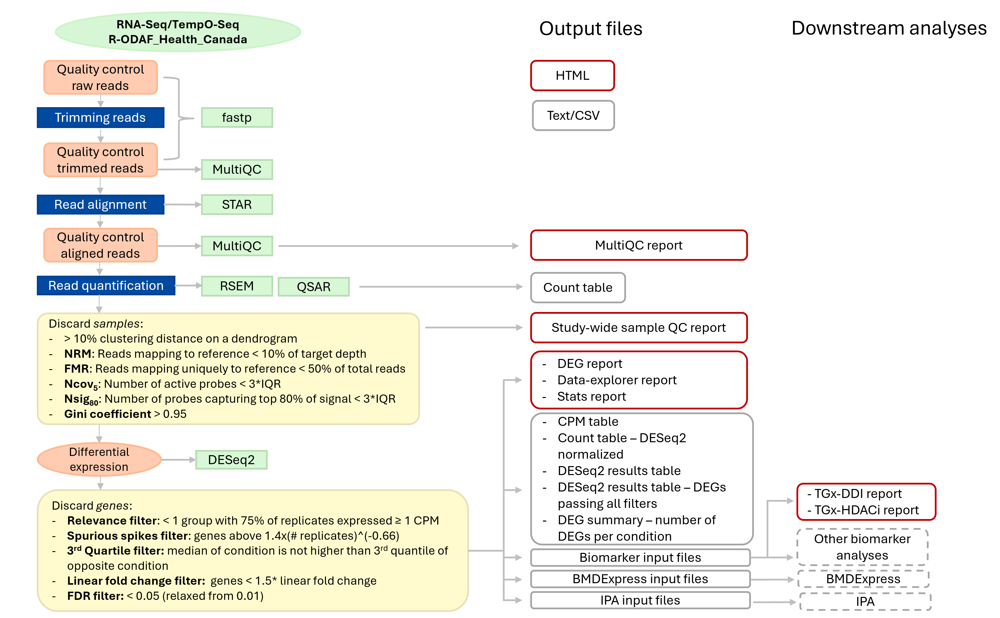
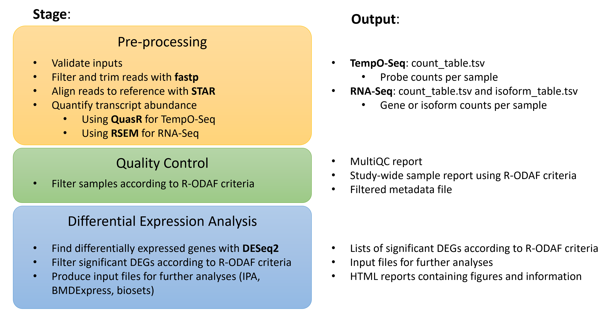

# Omics Data Analysis Frameworks for Regulatory application (R-ODAF) 

| Issues | Pull Requests | Repository Size |  Languages | License |  Tests | 
|:-------------|:-------------|:---------------|:--------------------------|:-------------|:---------------|
|  <br>    |  <br>   |  <br>  |    |  |  [](https://github.com/R-ODAF/R-ODAF_Health_Canada/actions/workflows/tests.yml) |


## What is the [R-ODAF](https://www.sciencedirect.com/science/article/pii/S0273230022000307)?

It is an analysis framework geared toward the use of 'omics data in toxicology experiments. It aims to use commonly available open-source tools for analysis of transcriptomic data, specifically using DESeq2 for the determination of differentially expressed genes (DEGs).

This R-ODAF repository, which was forked from the main branch, is under active development by researchers at Health Canada and has been used primarily in the context of regulatory toxicology. The intended use is for processing high-throughput sequencing data from FASTQ files to DEG lists, and to generate exploratory analyses for use in toxicology research.

## What does this repository do?
This repository can be used to analyze transcriptomic datasets generated by either [TempO-seq](https://www.biospyder.com/technology/) or RNA-seq. It generates:
- study-wide HTML reports on the quality of HTS data using MultiQC
- lists of differentially expressed genes (DEGS), filtered according to R-ODAF filtering criteria as set out in [the publication](https://www.sciencedirect.com/science/article/pii/S0273230022000307)
- output files formatted for use in BMD modeling or IPA analysis
- exploratory data visualization reports for DEGs, inspired by the regionReport DESeq2 reports
- interactive tables and plots related to analysis of gene expression




## What does this repository NOT do?
This repository provides no warranty or guarantees on the quality of your analysis. It is used actively in research projects and is not intended to provide any type of authoritative assessment of your data.

There may be other tools that are more applicable to your goals. Indeed, if you are not undertaking toxicogenomics experiments, then that is likely the case.

## How can I use this repository?
In its current state of development, this repository should be used by individuals (or teams) who are experienced with running bioinformatic analysis in a linux environment. Proficiency in R is also very helpful. It is necessary to understand scripting and how to process data. We encourage users to learn if they are interested in pursuing this type of data analysis; to that end, we provide a users guide below detailing the steps required to process data, and best practices for using this analysis pipeline.

## Annotation versions
For reasons of reproducibility, this respository uses the following annotation versions:

org.Hs.eg.db 3.14.0 (https://bioconductor.org/packages/release/data/annotation/html/org.Hs.eg.db.html)

org.Mm.eg.db 3.14.0 (https://bioconductor.org/packages/release/data/annotation/html/org.Mm.eg.db.html)


# Installation and getting started

## Installation option 1: Docker container

*Section coming soon!*


## Installation option 2: Clone the repo and install dependencies

### Cloning the repository

You should start by cloning the repository locally, to a computer that can handle analysis of your data and where your raw data is locally accessible.

You can clone the repository using this command:

`git clone https://github.com/R-ODAF/R-ODAF_Health_Canada.git`

#### Note: Working in RStudio
Typically, when undertaking a new analysis, it is a good idea to have a separate folder for each project. This makes it easier to manage, and also makes your code more portable. Working in RStudio facilitates these tasks.

Therefore, it is a good idea to open the cloned repository in RStudio as a project (there is already a project file by default in this repository, so RStudio should recognize it). This tells RStudio where to look for files, which is better than setting a working directory.

Note that R Studio Server has a built-in terminal in which unix commands can be run. However, you should use the command line in a separate terminal rather than using the one in R Studio Server. This is because Rstudio will try to use packages installed in user directories rather than those installed in conda environments, causing the pipeline run to abort.

### Installing Dependencies

- conda
- snakemake > 8.0 (see note on versions below)
- R

We recommend installing snakemake within its own conda environment to avoid conflicts.

**NOTE on Snakemake versions** : Snakemake v8.0 and above introduced changes to the snakemake command used to run the workflow. The commands given in this README apply to v8.0 and above. If you are using an earlier version of Snakemake, replace 
`--software-deployment-method conda` with `--use-conda`
For more information: https://snakemake.readthedocs.io/en/stable/project_info/history.html#detailed-breaking-changes 


If you do not yet have mamba, install it.

`conda install -n base -c conda-forge mamba`

Follow the installation steps provided in the snakemake documentation https://snakemake.readthedocs.io/en/stable/getting_started/installation.html#full-installation

```
conda activate base
mamba create -c conda-forge -c bioconda -n snakemake snakemake
```

To activate this environment:

`conda activate snakemake`

Other dependencies are managed by snakemake via the creation of conda environments. The conda environments needed for various steps of the workflow are defined in a series of .yml files in workflow/envs.


### Installing environments
__Environments must be installed *prior* to running the workflow__ because of additional dependencies that must be added to the R-ODAF_reports environment via the install.R script included in this repo. If you use snakemake to run the full workflow without first installing and fixing the environments, the workflow will not run to completion. This only needs to be done once per project, or once ever if you install environments [in a persistent location](####Persistent-environments). 

From inside the repo directory, run:

`snakemake --cores 32 --software-deployment-method conda --conda-create-envs-only`

*Choose the number of cores according to what is available in your system.*

Then install additional software in the reports environment: 

`conda run -p $(grep -rl "R-ODAF_reports" .snakemake/conda/*.yaml | sed s/\.yaml//) Rscript install.R`

#### Persistent environments
If you intend to run this analysis on multiple datasets, it can be advantageous to instead install the environments in a persistent location, and point to this location with snakemake's --conda-prefix flag. This avoids having to install the environments multiple times, which saves both time and disk place.

For example, the code below installs the environments in ~/snakemake_envs. Using this method, every time the analysis is run with snakemake, the command must include `--conda-prefix ~/snakemake_envs`

```
mkdir ~/snakemake_envs #Place and name this directory as you wish, and use correctly later with --conda-prefix

snakemake --cores 32 --software-deployment-method conda --conda-create-envs-only --conda-prefix ~/snakemake_envs/

conda run -p $(grep -rl "R-ODAF_reports" ~/snakemake_envs/*.yaml | sed s/\.yaml//) Rscript install.R
```

*When running the workflow, remember to use the --conda-prefix flag.*

# Running tests
It's a good idea to run a small test dataset through the workflow when you first install it. To do this:

Rename the inputs folder

`mv inputs inputs_bak`

Download the test dataset from our repository. This will create a new inputs directory already populated with the temposeq test data.

Be sure to download the release that matches the current state of the R-ODAF_Health_Canada pipeline.

```
wget https://github.com/EHSRB-BSRSE-Bioinformatics/test-data/releases/latest/download/temposeq-inputs.tar.gz
tar -xzf temposeq-inputs.tar.gz
mv temposeq/inputs .
```

Test run the pipeline (make sure you activate the snakemake environment first).

`snakemake --sdm conda --cores 32 -n`

If that works without error, actually run the pipeline.

`snakemake --sdm conda --cores 32`

Post-test, clean up and reset the repo so you can run the pipeline on your own data.
```
rm -r inputs
rm -r output
mv inputs_bak inputs
```

# Set up inputs

**More details as well as template files can be found in the inputs subdirectories.**

- Metadata file (tab delimited, in inputs/metadata/). Specify the name in the *metadata_file* parameter in config.yaml
- Contrasts file (tab delimited, in inputs/contrasts/). Specify the name in the *contrasts_file* parameter in config.yaml
- Config file (inputs/config/config.yaml)
- Reference files (inputs/reference/{reference_genome}.fa, inputs/reference/{reference_genome}.gtf) 
  - Note that files may be stored elsewhere and their location given in the config parameter *genomedir*
- __TempO-seq experiments only__ : TempO-Seq manifest file matching the genome reference files. We have created standardized TempO-Seq manifests, available at https://github.com/EHSRB-BSRSE-Bioinformatics/unify_temposeq_manifests/
  - Note that files may be stored elsewhere and their location given in the config parameter *biospyder_dbs*
  - The manifest file name (ex. "181019_Human_S1500_Surrogate_1.2_Manifest.txt") must be provided in the config parameter *biospyder_manifest_file*
- Raw fastq files (inputs/raw/) - file names must match the information in the metadata file.

### Config.yaml
The config file is the control centre for the workflow. An up-to-date default config is provided in the repo, and explanations of some of the commonly-adjusted parameters are provided in the readme in the config directory.

### Contrasts
The contrasts file is a tab-delimited text file that describes which contrasts of interest should be tested with the results() function of [DESeq2](https://bioconductor.org/packages/devel/bioc/vignettes/DESeq2/inst/doc/DESeq2.html#contrasts).

### Reference genome files

You must provide a reference sequence for alignment of the raw reads. For TempO-Seq experiments, these are provided by BioSpyder; for RNA-seq experiments they can be obtained through your favorite database. This is currently beyond the scope of this guide. Ensure you have some type of annotation file (GTF format) available as well, to dictate which sequences in the FASTA file correspond to which genes or probes. These will be used to create a STAR index within the directory where you store your reference genome.

### Sample names
A column labeled *sample_ID* must be included in the metadata table, containing a unique identifier for each sample. This identifier must match the fastq.gz file names in the following way:

For single-end sequencing:  *{sample_ID}*.fastq.gz

For paired-end sequencing: *{sample_ID}*.R1.fastq.gz and *{sample_ID}*.R2.fastq.gz

### Defining samples to remove from analysis
If there are samples in your inputs/raw/ directory that you want to exclude from QC and differential expression analysis (ex. samples that were exposed to cytotoxic doses based on laboratory tests), create a file named "remove.txt" in the inputs/metadata/ directory. In this file, give the sample names, one per line, matching the sample_ID column in the metadata file. These samples will still go through preprocessing (trimming and alignment) and appear in the count table, but will be removed during QC. A table of manually removed samples will appear in the QC report.

# Run the workflow


## Performing a dry run

We strongly recommend using snakemake's dry run functionality to check for errors before beginning an actual run. (See https://snakemake.readthedocs.io/en/v7.32.2/executing/cli.html).

Use the flags `--dry-run`, or `-n`

For example,
`snakemake -s ./workflow/Snakefile --cores 32 --software-deployment-method conda -n`

## Running the workflow

*If you installed the conda environments in a [persistent location](####Persistent-environments), remember to use the --conda-prefix flag.*

To run the whole pipeline:

`snakemake --software-deployment-method conda --cores 32`

Choose the number of cores according to what is available in your system.

### Running workflow sections



This workflow is modularized, so you can run (or re-run) some sections independently if needed. This can be beneficial if, for example:
- you found samples you wish to manually remove based on QC results and want to re-run the QC and differential expression steps. 
- you want to repeat differential expression analysis with different parameters

*Note that you need to run the pipeline steps in order; for example, you cannot do the quality control step if outputs from the preprocessing step do not yet exist.*

#### Preprocessing only
To run only the preprocessing steps and get a count table for TempO-Seq datasets:

`snakemake -s ./workflow/modules/1-preprocess_temposeq.smk --software-deployment-method conda --cores 32`

To run preprocessing steps and get a count table for RNA-Seq datasets:

`snakemake -s ./workflow/modules/1-preprocess_rnaseq.smk --software-deployment-method conda --cores 32`

#### Quality control

Once the preprocessing steps are complete, you can run (or re-run) the quality control steps. These apply the R-ODAF filters on all samples and produce a multiQC report, a study-wide report on quality control filters according to R-ODAF criteria, and a filtered metadata file.

`snakemake -s ./workflow/modules/2-qc.smk --software-deployment-method conda --cores 32`

**If you have already run the QC step and want to re-run it, you must delete or rename the output/QC directory**

#### Differential expression analysis

Once the preprocessing and quality control steps are complete, you can run (or re-run) differential analysis via DESeq2 and production of DEG reports. This will produce DEG lists, exploratory reports, and interactive gene expression reports that incorporate DEG filtering according to R-ODAF criteria.

`snakemake -s ./workflow/modules/3-diffexp_and_reports.smk --software-deployment-method conda --cores 32`

**Note that you will have to delete dummy output file "output/.rodaf_internal/reports_complete" to re-run the differential expression analysis step.**
`output/.rodaf_internal/reports_complete`

# Output files

## Quality control

- A [MultiQC](https://multiqc.info/) report
- An HMTL study-wide QC report showing pass/fail for samples according to to R-ODAF filtering criteria as set out in [Harrill et al. (2021)](https://pubmed.ncbi.nlm.nih.gov/33538836/)
- An update metadata file containing only samples that passed QC

## Differentially expressed genes

Each analysis folder contains the following subdirectories: reports, DEG_lists, RData, Pipeline_record, (optional) BMD_and_biomarker_files, (optional) pathway_analysis. 

__reports__ contains html reports:
- RNA-Seq report has volcano plots for each contrast, PCA plots to see clustering of groups (note the PCAs are identical across all comparisons, as they are not based on DEGs), DEG heatmaps, and plots of log2foldchange and normalized counts for the best 20 features (DEGs)
- data_explorer report has a table of significant DEGs and normalized count plots for the top 1000 (by absolute fold change) genes.
- stats report has information about the sample metadata, which contrasts were used in DESeq2 and how many DEGs were found per contrast, number of samples per group and a series of descriptive plots 
- optional reports for biomarkers (currently just TGx-DDI; more biomarkers still to come)

__DEG_lists__ contains lists of differentially expressed genes, as well as DEG information formatted to be used as input for further analysis tools (ex. IPA). If you specified DEseq_facets in the config file, subdirectories will be made for each facet, each containing:
- *_Per_sample_CMP.txt - A matrix of copies per million reads of each gene for each sample.
- *_Per_sample_normalized_counts.txt - a matrix of counts per gene per sample, normalized by the [DESeq2 counts function](https://bioconductor.org/packages/devel/bioc/manuals/DESeq2/man/DESeq2.pdf)
- *_DESeq_output_ALL.txt - DESeq2 results table for all features
- *_DESeq_output_all_genes.txt - DESeq2 results table for all genes (a filtered subset from *_DESeq_output_ALL.txt)
- *_DESeq_output_significant.txt - DESeq2 results table for features that passed all filters laid out in the R-ODAF framework (see "Methods Summary" in the RNA-Seq report for details)
- *_DEG_summary.txt - a table of the number DEGs passing all filters that were found per contrast

__RData__ contains an .RData file that can be used to re-import results to R for further analysis if needed. It also contains records of the contrasts and config file used.

__Pipeline_record__ contains copies of the config file, contrasts file, and reports environment used in the analysis. This is helpful in keeping track of the parameters used when running multiple analyses.

__BMD_and_biomarker_files__ contains files formatted for use in bmdexpress and various biomarker analysis (ex. TGx-DDI, TGx-HDACi)

__pathway_analysis__ contains reports on pathway analysis

# Tips and tricks
- The config and metadata input files are checked against yaml-formatted schema (under workflows/schema/) each time a snakemake workflow is started. If you get a red big block of error text before the snakemake DAG is created, it indicates that your input files don't match the schema requirements. Check the top of the red text for information about what to change.
- Snakemake decides which rules to run based on the existence of output files. If you want to re-run part of the workflow, you may need to delete or rename files or folders, otherwise Snakemake may declare that there's "nothing to be done". For example, rename output/QC to output/QC_{timestamp} to allow re-running of the QC step, or delete reports_complete to allow re-running of the differential expression analysis step.
- Analysis folders (output during the differential expression analysis step) are named according to the *analysis_name* parameter in the config + a timestamp. If you're changing parameters and re-running, be kind to your future self and give the analyses informative names.


# Troubleshooting


## Questions?

I'm not surprised if you have questions. This is very much a draft of the workflow, and is incomplete except for serving highly experienced users. Please reach out if you have questions or issues, and feel free to submit an [issue](https://github.com/R-ODAF/R-ODAF_Health_Canada/issues) or PR with any suggestions you might have.
